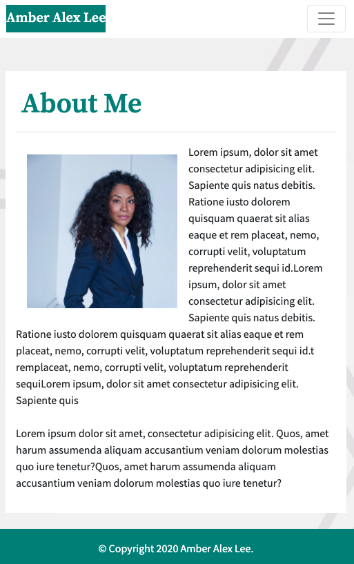
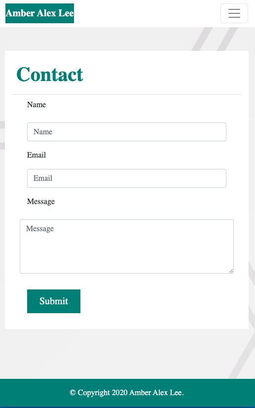
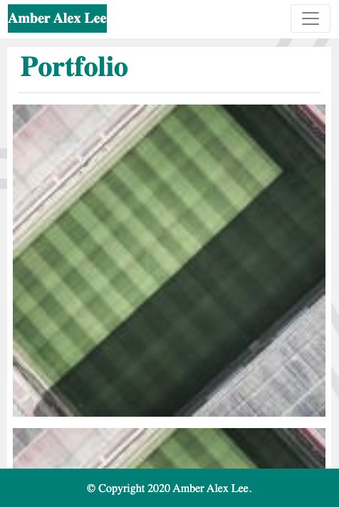
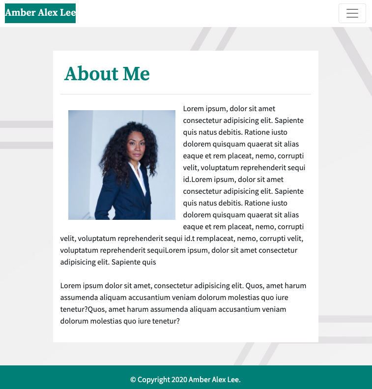
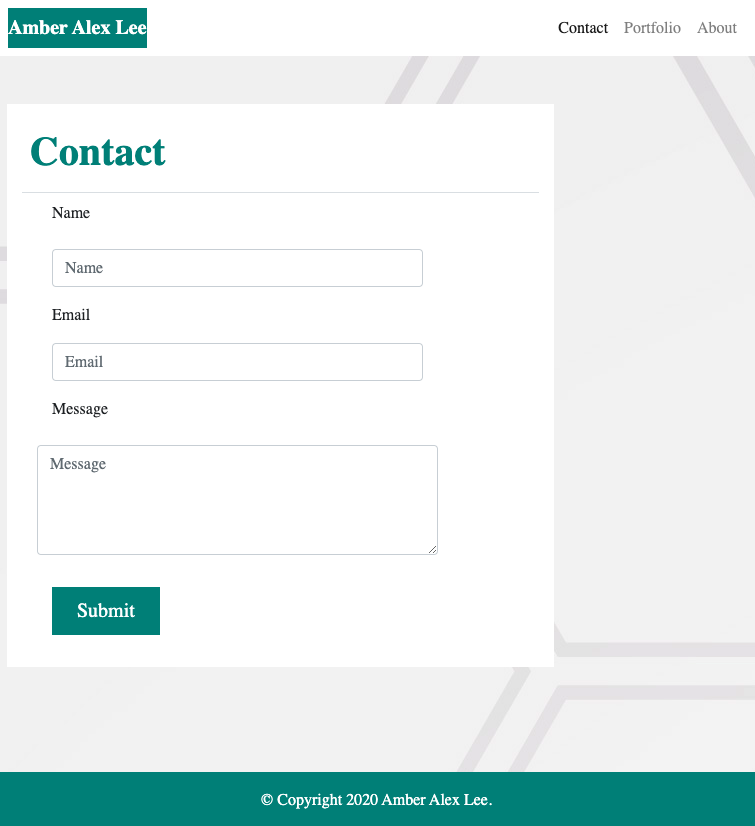
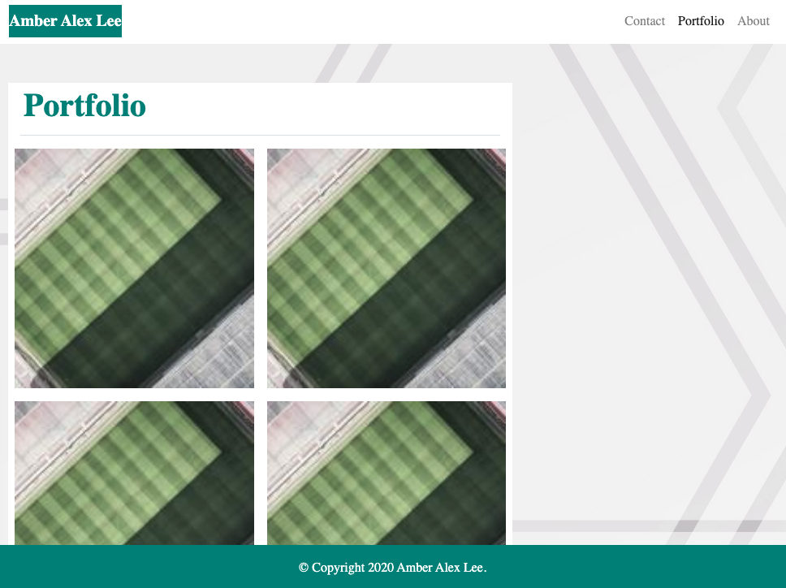
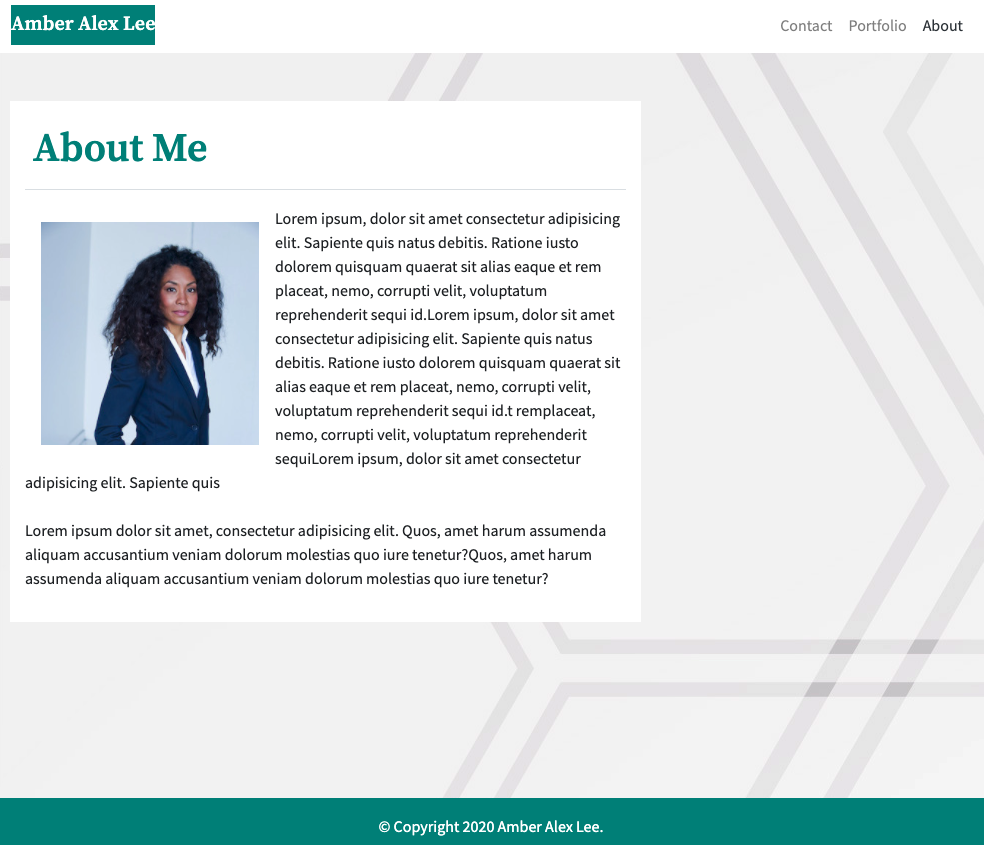
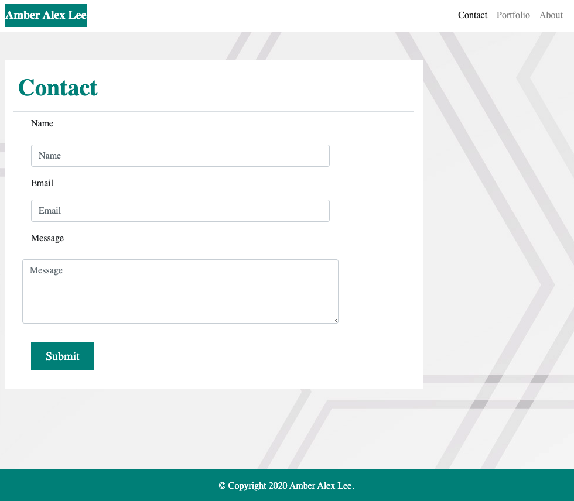
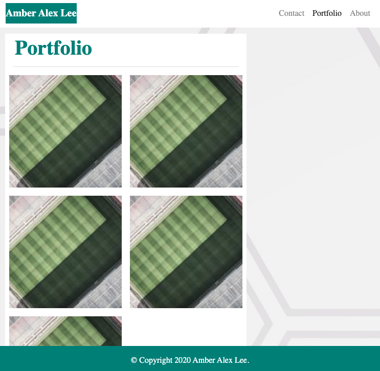

# Responsive.Design

## Description 
The purpose of this exercise was to recreate a responsive website using primarily Bootstrap and images that referenced aesthetic guidelines to follow.  This exercise was beneficial for exploring the many styling and structure efficiencies within Bootstrap.  It also helped simulate a real-life on-the-job scenario in which a client requests specific design details for a project. 

Below are screenshots of the project for each completed page and the deployable website can be accessed [here](https://lee-amber-alex.github.io/Responsive.Design/).  

### Resized at 400:

I am having issues with the images formatting correctly for the Portfolio page. 

### Resized at 768:

I am having issues with the images formatting correctly for the Portfolio page.

### Resized at 992:

I am having issues with the images formatting correctly for the Portfolio page.

## Credits
Below is a list of the resources used to complete this project:  

-Formatting and styling using [Bootstrap](https://getbootstrap.com/).  

-Images taken from [Freepik.com](https://www.freepik.com/).  

-Fonts take from [Google Fonts](https://fonts.google.com/).

